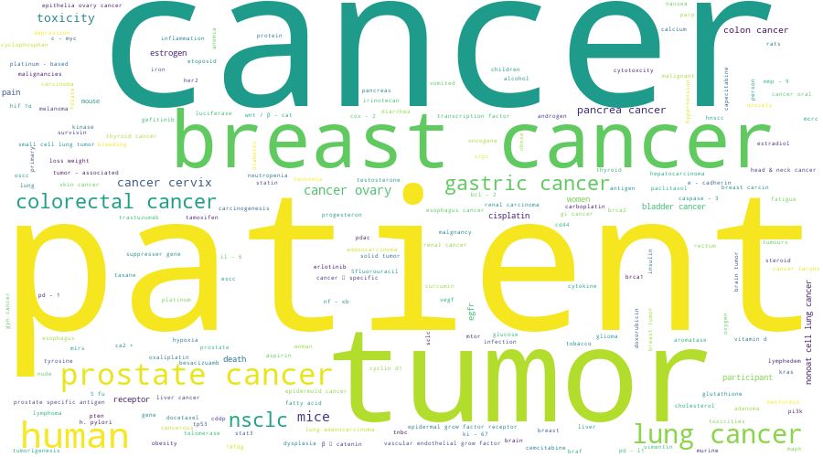

# Construction of a cancer-related Knowledge Graph

> HUSTAIA 2023 Spring undergraduate graduation project


Build a cancer-relatd Knowledge Graph from open source papers.

The final result contain 949,007 concept nodes and 4,766,994 triples. And the concept node will have a link to 1,023,966 paper nodes.

The building process is divided into 4 step:

1. data preparation: download data from xrxiv and pubmed and filter cancer-related paper using keywords and title
2. ner: train ner models and use them on prepared data
3. re: use OpenNRE package to get the relation between entities
4. term clustering: cluster similar entity into concepts
5. postprocess: generate KG triples and do viz

## Updates
- 20230416: finish viz🎉🎊🎉
- 20230413: finish postprocess
- 20230407: finish OpenNRE re
- 20230324: finish term clustering using CODER++
- 20230317: finish UIE test
- 20230310: finish biobert multiNERHead finetune and used it on my own corpus.
- 20230224: finish data preparation.

## Details

The KG is totally build **automatically** from pubmed and xrxiv papers.

At the paper collection stage, I collect **~1M cancer related papers** from pubmed/chemrxiv/medrxiv/biorxiv/arxiv.

I use a distant supervised method to train the NER models. NER dataset is the same as biobert's ner dataset. I train two NER models: multiNerHead version bioBERT and UIE. The multiNerHead version bioBERT is much better than UIE. So the multiNerHead version bioBERT model is used as the final NER model.

Then I use OpenNRE package to extract the relation between each entity. This step cost a lot of resource. I split the data into a lot of splits and use 48 V100 to infer. It cost ~11h to finish all the process.(This might be the most costly step in the whole project)

Then I use CODER++ model pulled from huggingface to do term clustering. This can group entities like cancers and cancer into a concept cluster which can make the KG more precise. The following is the word cloud after term clustering.



The following steps are just some post-process and viz using streamlit which I think there is no more to say about.

## Usage

1. create env using conda
    ```bash
    conda env create -f env.yaml
    conda activate cancerGraph
    python -m spacy download en_core_web_sm
    ```
2. use gdown to download graphData into `data/graphData` folder
    ```bash
    gdown --folder https://drive.google.com/drive/folders/1NPG-61qI8IoUQAqdHGAUJUrdpvM1IR30?usp=sharing --output data/graphData
    ```
3. pull neo4j docker and build the database

    see more detail in [viz/import.md](./viz/import.md)
4. use streamlit to viz the data
    ```bash
    cd viz
    streamlit run databaseKGviz.py
    ```
